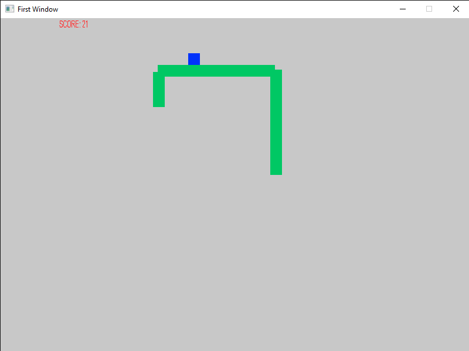
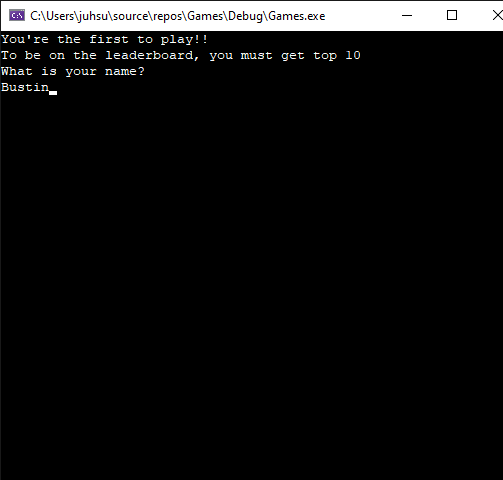

# Snake
It's basically the snake you used to see on youtube loading screens or the fancy google pages.







# Requirements(Windows visual studio)
Download and install SDL2 [here](https://www.libsdl.org/).
Then do the following 3 steps for setup
#### include directories
```
right click on your project -> properties -> C/C++ -> general -> additional include directories -> type path/to/SDL2/include folder
```
#### library directories
```
right click on your project -> properties -> Linker-> general -> additional library directories -> type path/to/SDL2/lib/x86 folder
```

#### dependencies
```
right click on your project -> properties -> Linker-> input -> type SDL2_image.lib SDL2_ttf.lib SDL2_.ib SDL2main.lib
```

# Requirements(Linux)
#### configure libraries
```
./configure.sh
```
#### go to src directory and type 'make'
```
make
```
#### run game
```
./snake
```

# Rules
Eat the blue squares to get 10 points, avoid hitting yourself and the walls.
If you score top 10, type your name **WITHOUT SPACES PLEASE**

# Controls
- **arrow keys** (up,left,down,right)
- **p** pause
- **ESC** to exit conosle  

# Possible future updates
- to save memory space, represent the snake as bits rather than ints
